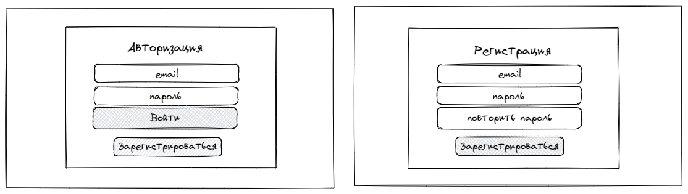
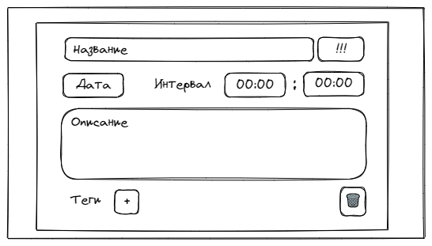
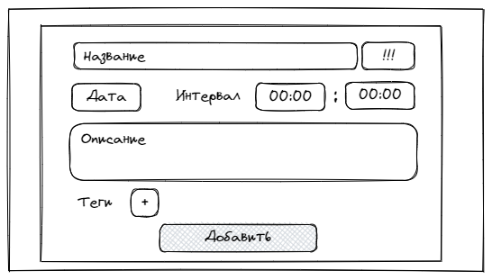
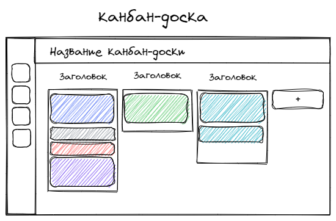
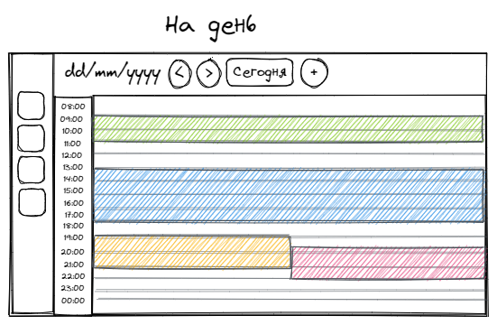
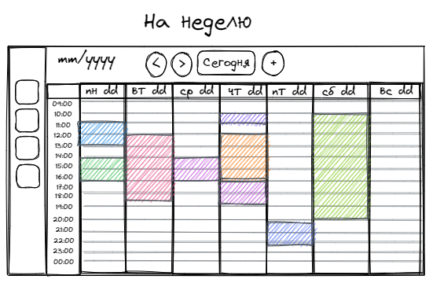

# 1. Цель проекта

Цель проекта - разработать таск менеджер. Пользователь сможет создавать задачи (далее таска), взаимодействовать с ними и представлять список задач в разном виде.

## 1.1. Описание таски

Должна обладать:

- Названием
- Описанием
- Временем
- Приоритетом
- Тегом

Описание, время, приоритет, тег не обязательны и вводятся по желанию пользователя

# 2. Основные функциональные блоки:

- Регистрация, аутентификация и авторизация
- Функционал взаимодействия с тасками
- Функционал различного представления списка тасков

## 2.1. Регистрация, авторизация

Пользователю предлагается ввести email и пароль, чтобы войти в сервис, либо зарегистрироваться, соответственно на странице регистрации поля:

1. email
2. пароль

И две кнопки:

1. кнопка “Войти”
2. Менее выделенная кнопка “Зарегистрироваться”

В случае регистрации пользователь переходит на окно регистрации, где видит поля:

1. email
2. пароль
3. повторить пароль

Кнопки:

1. Зарегистрироваться

## 2.2. Функционал взаимодействия с тасками

У пользователя должен быть следующий функционал взаимодействия с тасками:

- Просмотр
- Добавление
- Редактирование
- Удаление

### 2.2.1. Просмотр и редактирование таски:

У пользователя должна быть возможность просматривать и редактировать все свойства таски. Следовательно, пользователь видит и может изменять поля:

- Название
- Приоритет
- Дата и интервал
- Описание
- Теги

Кнопка:

- Удалить

### 2.2.2. Добавление таски:

У пользователя должна быть возможность добавлять все свойства таски. Следовательно, пользователь заполняет поля:

- Название
- Приоритет
- Дата и интервал
- Описание
- Теги

Кнопка:

- Добавить

## 2.3. Функционал различного представления списка тасков

Представление в следующих видах:

- На день
- На неделю
- Канбан-доска

### 2.3.1. Общий навбар:

Общий левый навбар содержит кнопки переключения на различные представления списка тасков.

### 2.3.2. Канбан-доска:

Содержит:

- название канбан-доски
- колонки, в которых отображаются таски
- кнопку добавления новой колонки

### 2.3.3. На день:

В верхнем навбаре:

- дата
- кнопка на предыдущий день
- кнопка на следующий день
- кнопка возвращающая на сегодняшний день
- кнопка добавления задач

Поле задач в виде таблицы из двух столбцов, в левом - временные интервалы, в правом отображаются задачи.

### 2.3.4. На день:

В верхнем навбаре:

- дата
- кнопка на предыдущую неделю
- кнопка на следующий неделю
- кнопка возвращающая на текущую неделю
- кнопка добавления задач

Поле задач в виде таблицы, в первом - временные интервалы, в последующих отображаются задачи в соответствии с днем недели.

